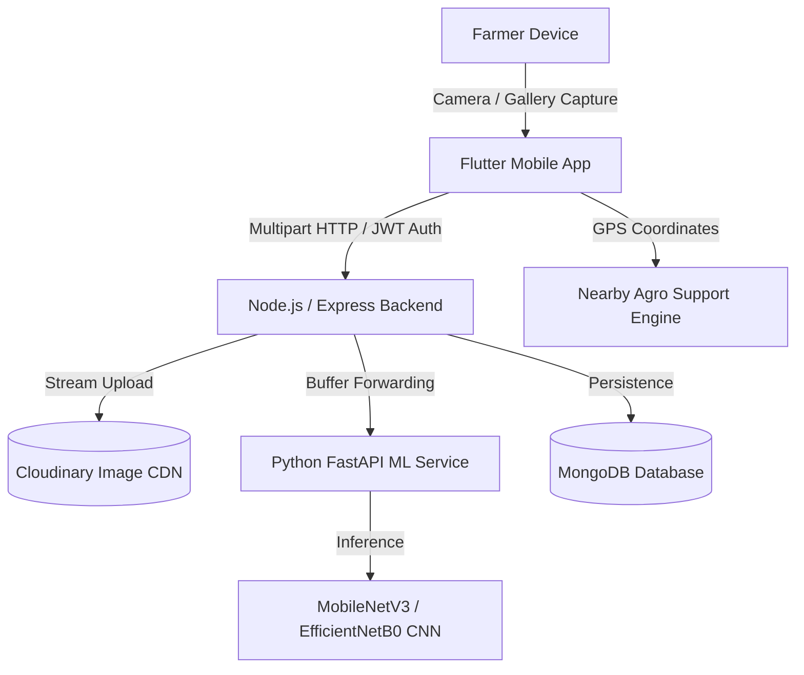

# AI-AgriVision: Production-Oriented Smart Agriculture Crop Disease Detection & Advisory Platform

[](https://opensource.org/licenses/MIT)
[](https://fastapi.tiangolo.com)
[](https://tensorflow.org)
[](https://nodejs.org)
[](https://flutter.dev)
[](https://www.docker.com)

**AI-AgriVision** is an enterprise-grade agricultural AI platform engineered to assist farmers and agronomists in diagnosing crop diseases, verifying photographic quality, obtaining safe non-toxic agricultural advisory, and discovering nearby agricultural assistance centers.

---

## 1. Architecture Overview

AI-AgriVision follows a clean, decoupled microservices pattern:



---

## 2. Core Features

- **End-to-End Farmer Workflow**: Capture leaf photos via Camera or Gallery, inspect quality, diagnose diseases with deep learning, and track historical scans.
- **Pre-Inference Image Quality Gate**: Algorithms evaluate Laplacian blur variance, minimum resolution (>=200x200px), and exposure boundaries (underexposed / glare detection). Blurry photos are rejected before ML inference.
- **Confidence-Aware Triage**:
  - $\ge 80\%$: High Confidence.
  - $60\% - 79\%$: Medium Confidence.
  - $< 60\%$: Marked as **Uncertain**. Refuses to falsely hallucinate diseases when confidence is low.
- **Severity Transparency**: Adheres strictly to agricultural AI integrity. Unless trained on lesion segmentation, severity explicitly discloses `severity_available: false` with clear guidance.
- **Safe Agronomic Recommendations**: Provides cultural and biological prevention strategies. Strictly prohibits fabricated chemical pesticide dosages.
- **Nearby Agriculture Support**: Discovers nearby Krishi Vigyan Kendras (KVKs), certified fertilizer/seed depots, and agricultural extension offices using Haversine formulas.
- **Enterprise Security**: Password hashing with bcrypt, JWT token authentication, Helmet HTTP headers, CORS origin controls, and express rate limiting.

---

## 3. Technology Stack

| Layer | Technologies |
|---|---|
| **Mobile Frontend** | Flutter, Dart 3, Material 3, Provider, Geolocator, Image Picker, Cached Network Image |
| **Backend API** | Node.js, Express.js, MongoDB, Mongoose, JWT, bcryptjs, Multer, Cloudinary SDK, Helmet, Winston |
| **ML Microservice** | Python 3.10+, FastAPI, TensorFlow/Keras, OpenCV, Pillow, Pydantic, Scikit-learn |
| **DevOps & Containers**| Docker, Docker Compose, Nginx, Pytest, Jest, Supertest |

---

## 4. Complete Folder Structure

```
AI_AgriVision/
├── frontend/                     # Flutter mobile application
│   ├── lib/
│   │   ├── core/                 # Constants, theme, routes, network, storage, utils
│   │   ├── models/               # User, prediction, disease, and agro location models
│   │   ├── services/             # API, auth, prediction, location, and image services
│   │   ├── providers/            # State management (AuthProvider, PredictionProvider, LocationProvider)
│   │   ├── screens/              # Splash, auth, home, scan, prediction, history, nearby agro, profile
│   │   ├── widgets/              # PredictionCard, ConfidenceIndicator, SeverityBadge, LoadingWidget
│   │   ├── app.dart              # MaterialApp setup & MultiProvider
│   │   └── main.dart             # Application entrypoint
│   ├── test/                     # Unit & widget tests
│   └── pubspec.yaml              # Dart dependencies & assets
│
├── backend/                      # Node.js / Express API gateway
│   ├── src/
│   │   ├── config/               # DB, Cloudinary, and environment configuration
│   │   ├── models/               # Mongoose User and Prediction schemas
│   │   ├── controllers/          # Auth, prediction, user, and agro controllers
│   │   ├── routes/               # API v1 routes
│   │   ├── middleware/           # JWT auth, Multer upload, and centralized error handling
│   │   ├── services/             # Cloudinary upload stream, ML forwarder, agro distance engine
│   │   ├── utils/                # Logger, standard API response formatter
│   │   ├── app.js                # Express app configuration
│   │   └── server.js             # Server bootstrap & graceful shutdown
│   ├── tests/                    # Jest unit & integration tests
│   ├── package.json
│   ├── .env.example
│   └── Dockerfile
│
├── ml-service/                   # Python FastAPI ML microservice
│   ├── app/
│   │   ├── api/                  # Prediction & health endpoints
│   │   ├── core/                 # Settings, thresholds, and logging
│   │   ├── models/               # Pretrained weights (.keras) & class_names.json
│   │   ├── schemas/              # Pydantic request/response schemas
│   │   ├── services/             # Predictor, preprocessing, image quality, severity, recommendations
│   │   └── utils/                # PIL / OpenCV conversion utilities
│   ├── dataset/                  # Raw, train, validation, and test directories
│   ├── notebooks/                # EDA, preprocessing, training, and evaluation notebooks
│   ├── scripts/                  # train.py, evaluate.py, export_model.py
│   ├── tests/                    # Pytest test suite
│   ├── requirements.txt
│   └── Dockerfile
│
├── docs/                         # Architecture, ML, API, Database, and Deployment guides
├── docker-compose.yml            # Multi-service orchestration
├── .gitignore
└── README.md
```

---

## 5. Quick Start with Docker Compose

Ensure Docker and Docker Compose are installed:

```bash
# 1. Clone repository
git clone https://github.com/your-org/AI-AgriVision.git
cd AI-AgriVision

# 2. Configure environment
cp backend/.env.example backend/.env

# 3. Spin up MongoDB, ML Service, and Backend
docker compose up -d --build
```

Verify services:
- **Backend Health**: `http://localhost:5000/health`
- **ML Service Swagger**: `http://localhost:8000/docs`
- **MongoDB**: `localhost:27017`

---

## 6. Manual Component Setup

### Backend (Node.js)
```bash
cd backend
npm install
npm run dev
```

Run tests:
```bash
npm test
```

### ML Microservice (Python)
```bash
cd ml-service
python -m venv .venv
source .venv/bin/activate  # On Windows: .venv\Scripts\activate
pip install -r requirements.txt
uvicorn app.main:app --host 0.0.0.0 --port 8000 --reload
```

Run tests:
```bash
pytest tests/ -v
```

### Frontend (Flutter Mobile App)
```bash
cd frontend
flutter pub get
flutter run
```

Run tests:
```bash
flutter test
```

---

## 7. Model Training Pipeline

To train the model on your agricultural dataset:

1. Organize your dataset in `ml-service/dataset/`:
   ```
   ml-service/dataset/
       train/
           Tomato___Healthy/
           Tomato___Early_Blight/
           Tomato___Late_Blight/
       validation/
           ...
   ```
2. Execute the two-stage transfer learning training script:
   ```bash
   python ml-service/scripts/train.py --backbone MobileNetV3Large --epochs_head 15 --epochs_finetune 10
   ```
3. Evaluate metrics (accuracy, precision, recall, F1, confusion matrix):
   ```bash
   python ml-service/scripts/evaluate.py
   ```
4. Export to TFLite for on-device deployment:
   ```bash
   python ml-service/scripts/export_model.py --quantize
   ```

---

## 8. Dataset Limitations & Ethical AI Advisory

1. **Environmental Domain Shifts**: Field images with diverse soil moisture, lighting glare, and background vegetation can affect inference. The built-in quality gate mitigates this by flagging poor captures.
2. **Safe Agricultural Practices**: The system strictly avoids fabricating chemical pesticide dosages. Farmers are guided toward biological/cultural solutions and advised to consult local extension officers for approved chemical interventions.

---

## 9. License

Distributed under the MIT License. See `LICENSE` for more information.
