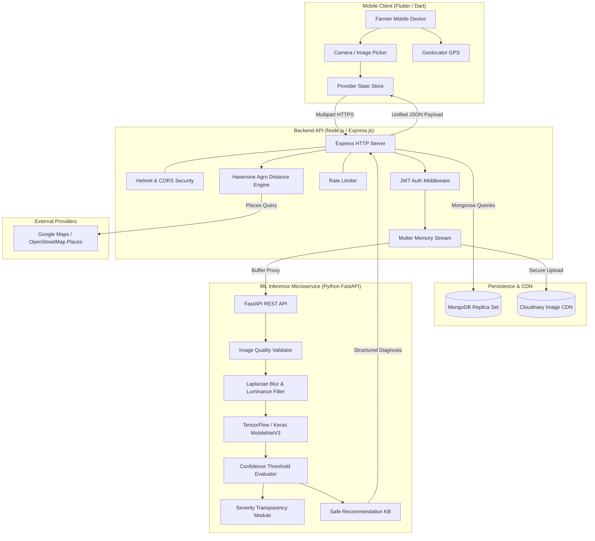
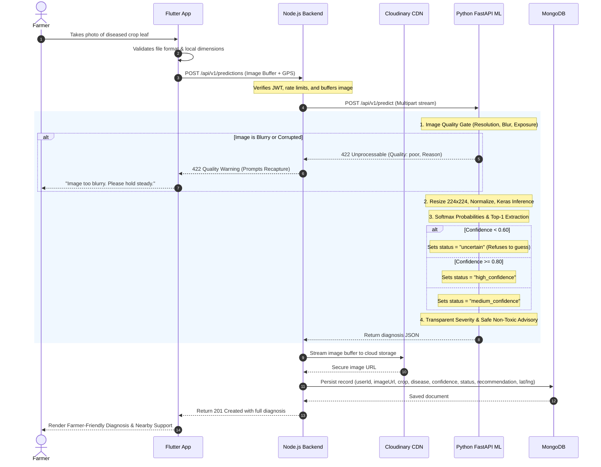

# AI-AgriVision Architecture Documentation

## System Overview

AI-AgriVision is an enterprise-grade agricultural diagnostic ecosystem engineered to assist smallholder farmers and agronomy professionals in accurately identifying foliar diseases, assessing image quality, obtaining safe biological/cultural farming recommendations, and finding nearby agricultural assistance centers.

---

## High-Level Architecture Diagram

---

## Data Flow & Inference Pipeline

---

## Core Security Architecture

1. **Zero Secret Leakage**: Credentials (`JWT_SECRET`, `CLOUDINARY_API_SECRET`, `MAPS_API_KEY`) reside exclusively in encrypted environment variables and are excluded via `.gitignore`.
2. **Sanitized Error Responses**: The backend intercepts unhandled exceptions, logging technical traces internally via Winston while delivering safe, non-leaking error codes to the mobile client.
3. **Pesticide Safety Guardrail**: The ML microservice and recommendation engines strictly prohibit chemical prescriptions or fabricated dosages.
